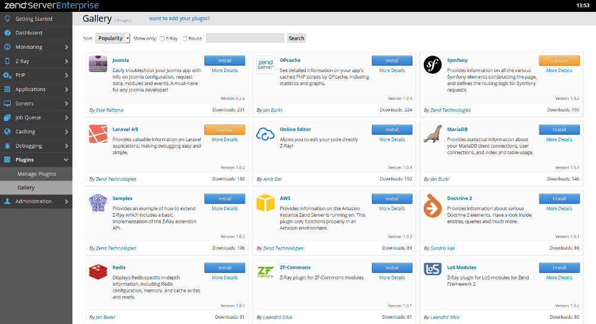
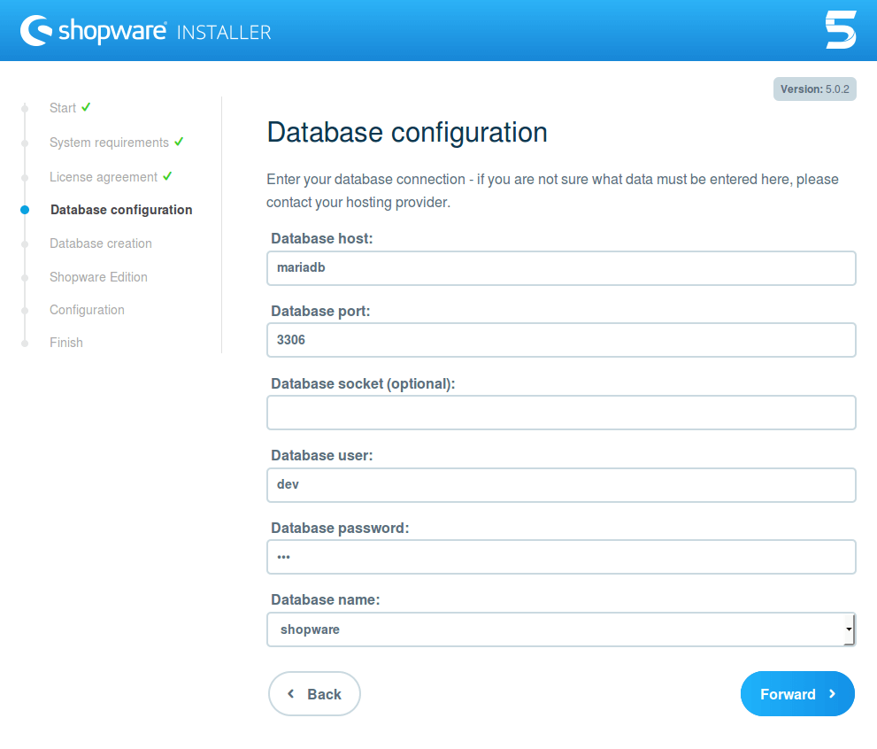
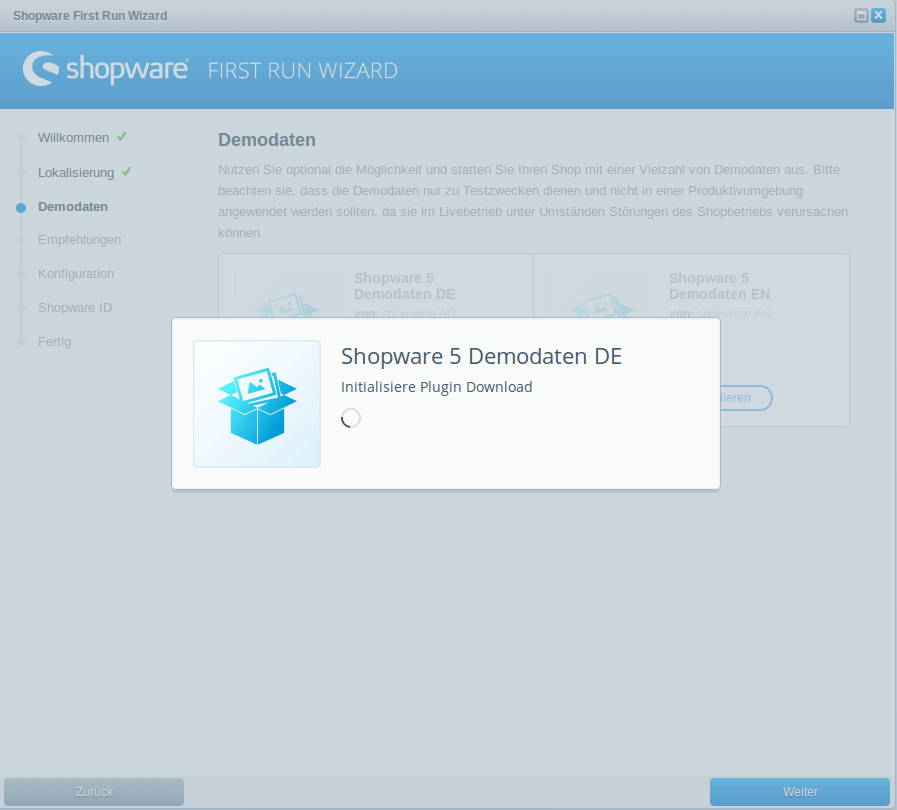

# Zend Server Z-Ray Doctrine 2 plugin Shopware demo

Welcome to the [Zend Server Z-Ray Doctrine 2 plugin](https://github.com/sandrokeil/Z-Ray-Doctrine2) Shopware demo. 
There are two installation methods. Please choose your prefered method. Windows user should choose 
*Install with Vagrant*, but it works also for linux.

## Installation with Docker
First ensure Docker and Docker Compose are installed. If not simply install these tools as root with:

```bash
$: wget -qO- https://get.docker.com/ | sh
$: curl -L https://github.com/docker/compose/releases/download/1.3.2/docker-compose-`uname -s`-`uname -m` > /usr/local/bin/docker-compose && chmod +x /usr/local/bin/docker-compose
```
It's recommended to use the latest version of Docker and Docker Compose. Now let's start the containers with:

```bash
$: docker-compose up -d
```
Docker will now download all dependencies and starts the containers. This may take a while ...
See official [Zend Server Z-Ray Doctrine 2 plugin site](https://github.com/sandrokeil/Z-Ray-Doctrine2) for some impressions.

## Installation with Vagrant

> If you restart the Vagrant box, you must install the Doctrine 2 plugin and finish Shopware installation.

Please install the following software if not already installed:

* [Vagrant > 1.7.3](http://www.vagrantup.com/downloads.html)
* [Virtualbox > 4.3](https://www.virtualbox.org/wiki/Downloads)
* [Vagrant docker-compose plugin](https://github.com/leighmcculloch/vagrant-docker-compose) (`vagrant plugin install vagrant-docker-compose`)

```bash
$: vagrant up
```
All dependencies will be downloaded. This may take a while ...
See official [Zend Server Z-Ray Doctrine 2 plugin site](https://github.com/sandrokeil/Z-Ray-Doctrine2) for some impressions.

## Install Z-Ray Doctrine 2 plugin
If the installation process was successful, you can now open the Zend Server backend url 
[http://localhost:10081](http://localhost:10081). The **password** is *admin*.

It's necessary to install the Doctrine 2 Z-Ray plugin from the Zend Server Z-Ray plugin gallery. Simply click on the 
install button of the Doctrine 2 plugin.



## Finish Shopware installation
Now open [http://localhost:8080](http://localhost:8080/) and follow the Shopware install instructions.

**Database credentials:**

* Server: *mariadb*
* User: *dev*
* Password: *dev*
* Database: *shopware*




### Install demo data
After the installation open the Shopware backend [http://localhost:8080/backend](http://localhost:8080/backend) and install the 
demo data.



Open the demo shop website [http://localhost:8080](http://localhost:8080) and check out the Z-Ray Doctrine 2 plugin.
